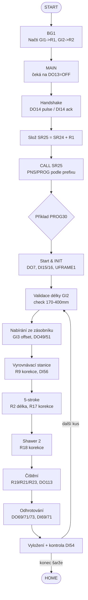
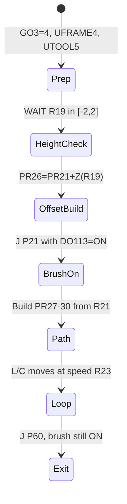

# Robotická buňka – architektura a tok programu

## Jak funguje MAIN a handshake s PLC
- MAIN je trvalý dispatcher. Ihned po startu hlídá, aby nebyla aktivní simulace I/O (`DO[13]`). Jakmile je povoleno, vstoupí do nekonečné smyčky `LBL[1]`.
- V každém průchodu vyšle synchronizační impuls `DO[14]=ON`, počká na potvrzení z PLC na `DI[14]`, impuls opět vypne a čeká na uvolnění vstupu. Tím si s PLC potvrzuje, že obě strany jsou v taktu, než spustí další cyklus.
- Po handshake složí název programu: prefix v textovém registru `SR[24]` spojí s číslem v `R[1]` do `SR[25]` a pomocí `CALL SR[25]` spustí odpovídající TP program. Po návratu se vrací na začátek smyčky a proces opakuje.【F:main.ls†L3-L27】

## Jak robot přijímá číslo programu a délku trubky
- Číslo programu přichází z PLC na skupinový vstup `GI[1]`. Background úloha `BG1` hodnotu ukládá do registru `R[1]` a paralelně ji posílá zpět na skupinový výstup `GO[1]` pro diagnostiku. Stejným způsobem zpracovává délku trubky na `GI[2]` do `R[2]`/`GO[2]`, takže jsou data k dispozici dříve, než MAIN skládá název programu.【F:bg1.ls†L1-L30】
- V samotných cyklech (např. PROG30) se délka pro validaci načítá z `GI[2]` do pracovního registru `R[10]`, aby se potvrdilo, že PLC posílá hodnotu v požadovaném rozsahu (170–400 mm).【F:prog30.ls†L19-L55】

## Jak se rozhoduje, který TP program se spustí
- PLC určuje číslo programu na `GI[1]`; textový prefix `SR[24]` (typicky `PNS` nebo `PROG`) se nastavuje ve string registru podle konvence buňky.
- MAIN vždy skládá `SR[25] = SR[24] + R[1]` a volá přesně tento název. Pro PNS programy tak vznikají jména jako `PNS900`, pro PROG varianty `PROG30` apod. Výsledek volání závisí pouze na kombinaci prefixu a čísla, takže stejné číslo může spouštět různé procedury podle zvoleného prefixu.

## Obecná struktura jednoho výrobního cyklu (příklad PROG30)
1. **Start & bezpečnost** – čeká na povolení z PLC (`DO[7]`), vypnutou simulaci (`DO[13]`) a připravené gripery (`DI[15]`, `DI[16]`), přepne se do výchozího rámce/nástroje a zavolá INIT pro reset I/O a griperů.【F:prog30.ls†L1-L33】
2. **Validace vstupů** – v úvodu cyklu ověří délku trubky z `GI[2]` a jistí, že v gripech ani čidlech není zbylý díl (`!DI[50]`, `!DI[52]`).【F:prog30.ls†L19-L40】【F:prog30.ls†L56-L68】
3. **Nabírání ze zásobníku** – taktovací puls na podavač (`DO[58]`), čekání na potvrzení přítomnosti (`DI[77]`), výpočet offsetu podle pozice v zásobníku (`GI[3]`) a vlastní uchopení pomocí `DO[49]/DO[51]` s kontrolou vstupů.【F:prog30.ls†L34-L70】
4. **Předávka do vyrovnávací stanice** – přepnutí na UFRAME 2, založení do lůžka s korekcí natočení z registru `R[9]`, uvolnění griperu po potvrzení čidel a návrat do bezpečné pozice.【F:prog30.ls†L72-L108】
5. **Obsluha strojů** – sekce „5-stroke“ (UFRAME 2/UTOOL 6) a „Shawer 2“ (UFRAME 3) odebírají a vracejí díl do jednotlivých zařízení. Používají délkový offset `R[2]`, korekce `R[17]`, `R[18]`, řídí lokální upínky (`DO[62]`, `DO[66]`–`DO[68]`) a detekují kontakt (`DI[61]`, `DI[63]`, `DI[67]`).【F:prog30.ls†L122-L178】【F:prog30.ls†L200-L274】
6. **Nově doplněné čištění a odhrotování** – v UFRAME 4 provádí obkroužení dílu se Z-korekcí `R[19]`, excentricitou `R[21]` a rychlostí `R[23]`, přitom zapíná čistící pohon `DO[113]`. Následuje odhrotovací jednotka s čelistmi `DO[69]/DI[71]`, potvrzovacím pulzem `DO[73]` a návratem s vypnutím pohonu.【F:prog30.ls†L276-L346】
7. **Vyložení a smyčka** – po dokončení přechází na UFRAME 5 pro vyložení, případně kontroluje požadavek konce šarže (`DI[54]`). Pokud konec není aktivní, vrací se na začátek cyklu; jinak jede domů (`PR[2]`).【F:prog30.ls†L346-L378】

## Blokové schéma (mermaid)


## ÚKOL 2 – Původní logika vs. nové rozšíření (čištění + odhrotování)
- **Původní části** (zásobníky, vyrovnávací stanice, 5-stroke, Shawer 2)
  - *Vstupní zásobník* (GO[3]=6, UFRAME 1): takt pulsem `DO[58]`, čekání na přítomnost `DI[77]/DI[53]`, výpočet posuvového offsetu z `GI[3]` do `PR[14]`, sejmutí dílu gripery `DO[49]/DO[51]` a potvrzení `DI[50]` před odjezdem.【F:prog30.ls†L33-L70】
  - *Vyrovnávací stanice* (GO[3]=?, UFRAME 2): založení do lůžka s natočením `R[9]` a potvrzovacími signály `DI[56]`, `DI[49]`, `DI[50]` pro korektní uložení; používá `DO[116]` pro pohyb do lůžka a uvolnění griperu.【F:prog30.ls†L72-L108】
  - *5-stroke* (GO[3]=2, UFRAME 2, UTOOL 6→5): vyzvednutí dílu (`DI[61]`, lokální upínky `DO[62]/DI[62]/DI[64]`), přepočet délky `PR[21,3]=345-R[2]` a výšková korekce `R[17]`, vložení zpět se stiskem čelistí `DO[63]/DO[64]` a potvrzením `DI[63]/DI[64]/DI[49]`.【F:prog30.ls†L125-L185】
  - *Shawer 2* (GO[3]=3, UFRAME 3): obdobná sekvence s lokálními upínkami `DO[66]/DI[66]/DI[68]`, výškovou korekcí `R[18]` a potvrzením kontaktu `DI[67]`; používá přenastavení rámců a tool-offsetu pro vložení a odebrání dílu.【F:prog30.ls†L187-L246】
- **Nově doplněná logika**
  - *Čištění* (GO[3]=4, UFRAME 4): výšková korekce kartáče `R[19]` zapisovaná do `PR[26,3]`, generování čtyř rohů obkružné dráhy z excentricity `R[21]` (`PR[27]–PR[30]`) a rychlost profilu z `R[23]`. Kartáč se zapíná při nájezdu `DO[113]` a zůstává aktivní po dobu okruhu.【F:prog30.ls†L248-L318】
  - *Odhrotování* (UFRAME 4): čeká na připravenost jednotky `DI[69]`, zajede nad a do čelistí (`P[62]/P[63]` s výškou z `PR[26]`), sevře čelisti `DO[69]` s potvrzením `DI[71]`, uvolní robotí griper `DO[49]`, spustí proces pulsem `DO[71]`, po ukončení `!DI[71]` vyšle potvrzení `DO[73]` a odjede s vypnutím kartáče `DO[113]`.【F:prog30.ls†L296-L349】

## ÚKOL 3 – Skutečně používané digitální signály

| DI/DO | Komentář / význam | Použité programy | Popis funkce |
| --- | --- | --- | --- |
| DO[7] | Povolení cyklu z PLC | PROG10/20/30 | Start interlock před zahájením cyklu.【F:prog30.ls†L1-L4】 |
| DO[13] | Simulace I/O blokuje běh | MAIN, PROG10/20/30 | Musí být OFF před handshake a startem cyklu.【F:main.ls†L3-L10】【F:prog30.ls†L1-L4】 |
| DO[14] / DI[14] | Handshake impuls s PLC | MAIN | Pulz pro potvrzení taktu mezi PLC a robotem.【F:main.ls†L6-L14】 |
| DO[49]/DO[51] + DI[49]/DI[51]/DI[50]/DI[52] | Ovládání a potvrzení obou griperů | INIT, PROG30, OPEN_CLOSE makra | Sepnutí/rozepnutí čelistí a kontrola, zda drží/neudržují díl.【F:init.ls†L1-L18】【F:prog30.ls†L26-L70】 |
| DO[58] / DI[77]/DI[53] | Takt zásobníku a detekce dílu | PROG30 | Puls na podavač a potvrzení přítomnosti ve vstupní stanici.【F:prog30.ls†L33-L70】 |
| DI[56] | Stav vyrovnávací stanice | PROG30 | Čekání na volné lůžko před založením trubky.【F:prog30.ls†L72-L92】 |
| DO[116]/DO[77]/DI[53] | Pohyb do lůžka / bypass starého kusu | PROG30 | Pomocné signály při založení, DI[53] vynechá krok pokud je díl už založen.【F:prog30.ls†L72-L108】 |
| GO[3] | Výběr stanice | PROG30 | Hodnoty 2/3/4/5 pro 5-stroke, Shawer 2, čištění, vyložení; 6 pro zásobník.【F:prog30.ls†L33-L108】【F:prog30.ls†L248-L334】 |
| DO[62]/DO[63]/DO[64] + DI[62]/DI[64]/DI[63] | Upínka 5-stroke | PROG30 | Sevření/uvolnění čelistí a potvrzení kontaktu stanice 1.【F:prog30.ls†L125-L185】 |
| DO[66]/DO[67]/DO[68] + DI[66]/DI[68]/DI[67] | Upínka Shawer 2 | PROG30 | Uzavření/otevření čelistí a detekce kontaktu stanice 2.【F:prog30.ls†L187-L246】 |
| DO[111]/DO[112]/DO[115]/DO[116] | Pomocné výstupy pro pohyby | PROG30 | Aktivují pneumatické/mechanické prvky během dráhových kroků stanic 1/2 a zásobníku.【F:prog30.ls†L33-L246】 |
| DO[113] / DI[69]/DI[71] | Pohon kartáče a stav odhrotovačky | PROG30 | Zapnutí čistícího pohonu, readiness/sepnutí čelistí v odhrotovací stanici.【F:prog30.ls†L248-L349】 |
| DO[69]/DO[71]/DO[73] | Odhrotovací čelisti a potvrzení cyklu | PROG30 | Sevření dílu v odhrotovačce, spuštění procesu a potvrzení dokončení PLC.【F:prog30.ls†L296-L349】 |
| DI[54] | Požadavek konce šarže | PROG30 | Rozhoduje, zda pokračovat v cyklu nebo jet domů.【F:prog30.ls†L333-L345】 |

### Rozdělení digitálních I/O podle stanic

- **Bezpečnost a řízení** – `DO[13]` blokuje běh v režimu simulace, handshake `DO[14]/DI[14]` drží takt s PLC a `DO[7]` je hlavní povolení cyklu; společně zajišťují, že MAIN ani výrobní programy nezačnou, dokud PLC nepotvrdí připravenost.【F:main.ls†L4-L35】【F:prog30.ls†L1-L25】
- **Vstupní zásobník** – pro taktování slouží puls `DO[58]`, na příchozí díl čeká `DI[77]/DI[53]`, a uchopení provádí kombinace `DO[49]/DO[51]` s potvrzením `DI[50]/DI[52]`; dohromady tvoří sekvenci nájezdu, uchopení a vytažení z podavače.【F:prog30.ls†L33-L70】
- **Vyrovnávací stanice** – `DI[56]` hlásí obsazenost lůžka, `DO[116]` ovládá mechaniku pro založení a `DO[49]/DI[49]/DI[50]` potvrzují odložení dílu; blok zajistí, že se díl neuloží, pokud je stanice plná nebo griper neotevře.【F:prog30.ls†L72-L108】
- **Stanice 5-stroke** – `DI[61]` potvrzuje otevření, `DO[62]` a `DO[63]/DO[64]` ovládají čelisti, `DI[62]/DI[64]/DI[63]` hlídají stav a `DO[111]` spíná pomocný pohyb; tvoří postup vyzvednutí, vložení a potvrzení kontaktu na stanici 1.【F:prog30.ls†L125-L185】
- **Stanice Shawer 2** – analogicky `DO[66]/DO[67]/DO[68]` a `DI[66]/DI[68]/DI[67]` ovládají a potvrzují čelisti, `DO[112]` je pomocný výstup pro nájezdy; celek pokrývá odebrání, korekci výšky a založení do stroje 2.【F:prog30.ls†L187-L246】
- **Stanice čištění (kartáč)** – `DO[113]` zapíná kartáč, korekce `R[19]/R[21]/R[23]` ovlivňují dráhu a využívají stav dílu v griperu `DI[49]` pro rozhodnutí, zda čištění provést; signály řídí celý okruh obkružování v UFRAME 4.【F:prog30.ls†L248-L318】
- **Stanice odhrotování** – připravenost hlásí `DI[69]`, sevření `DO[69]` s potvrzením `DI[71]`, start procesu `DO[71]` a potvrzení PLC `DO[73]`; spolu s uvolněním griperu `DO[49]/DI[49]` umožňují bezpečně předat díl do stroje a zpět.【F:prog30.ls†L296-L349】
- **Výstupní dopravník / vyložení** – v PROG30 řídí přechod na vyložení hlavně rámce a pozice, ale pomocné signály pro vyrovnání (`DO[77]`) a případný konec šarže `DI[54]` určují, zda robot odjede domů nebo pokračuje v cyklu.【F:prog30.ls†L69-L71】【F:prog30.ls†L333-L345】
- **Ostatní/pomocné** – `DO[111]/DO[112]/DO[115]/DO[116]` slouží k ovládání pneumatických či mechanických pohybů během nájezdů; nejsou vázány na jedinou stanici, ale doplňují lokální sekvence pro bezpečný přejezd a uvolnění dílu.【F:prog30.ls†L125-L246】

## ÚKOL 3b – Skupinové GI/GO signály

| GI/GO | Význam | Kde se používá | Dopad na chování |
| --- | --- | --- | --- |
| GI[1] | Číslo programu z PLC | BG1 načítá do `R[1]`, MAIN skládá název `SR[25]` | Určuje, který TP program (PNS/PROG) se spustí.【F:bg1.ls†L1-L30】【F:main.ls†L11-L35】 |
| GI[2] | Délka trubky | BG1→`R[2]`, výrobní programy validují v `R[10]` | Ovlivňuje výpočet offsetů a podmínku startu cyklu (170–400 mm).【F:bg1.ls†L23-L27】【F:prog30.ls†L21-L56】 |
| GI[3] | Index pozice v zásobníku | PROG30/PROG30ZAL `R[5]` | Přepočet X-offsetu pro odebrání dílu (`PR[14,1]=R[5]*(-38)`).【F:prog30.ls†L51-L70】 |
| GI[4] | Index/offset pro výstupní zásobník (starší programy) | PROG10ZAL/PROG110/PROG30ZAL `R[6]` | U starších variant ovlivňuje výpočet pozic při vyložení; nové PROG30 jej nepoužívá.【F:prog10zal.ls†L233-L238】【F:prog110.ls†L233-L239】 |
| GO[1]/GO[2] | Echo GI[1]/GI[2] zpět do PLC | BG1 | Diagnostika: PLC může číst, co robot vidí na GI, pro ladění receptur.【F:bg1.ls†L1-L30】 |
| GO[3] | Volba stanice | Všechny PROGxx | Hodnota 1–6 informuje PLC, kterou stanici robot obsluhuje (zásobník, 5-stroke, Shawer 2, čištění, vyložení).【F:prog30.ls†L42-L334】【F:prog20.ls†L40-L180】 |

Krátký komentář: GI[1]/GI[2]/GI[3] přenášejí recepturu z PLC (varianta, délka, pozice v zásobníku). BG1 je zrcadlí do GO[1]/GO[2] pro diagnostiku a výrobní programy nastavují GO[3] podle právě obsluhované stanice, aby PLC mohlo synchronizovat pomocné mechanismy.

## ÚKOL 3c – Background a pomocné programy

- **BG1** – běží paralelně, čte GI[1]/GI[2] do registrů `R[1]/R[2]` a okamžitě je posílá na GO[1]/GO[2]; tím zajišťuje, že MAIN vždy volí správný program a že délkový parametr je připraven před vstupem do cyklu.【F:bg1.ls†L1-L30】
- **INIT** – před startem nulováním smyčkou `DO[52..80]` vyčistí všechny technologické výstupy a dvoustupňově přepne oba gripery (`DO[49]/DO[51]` s čekáním na `DI[49]/DI[51]/DI[50]/DI[52]`), aby byly ve známém sepnutém stavu bez zbytku dílu.【F:init.ls†L1-L40】
- **OPEN_CLOSE_GR_1 / OPEN_CLOSE_GR_2** – univerzální makra „toggle“: pokud je příslušný griper už zapnutý a potvrzený vstupem, kód ho vypne a čeká na rozepnutí; jinak ho zapne a čeká na sepnutí. Umožňují jednoduché ruční volání bez znalosti aktuálního stavu.【F:open_close_gr_1.ls†L1-L35】【F:open_close_gr_2.ls†L1-L35】
- **HOME_RUC** – nastaví základní rámec `UFRAME 0` a nástroj `UTOOL 1`, poté jede přes výchozí bod `PR[1]` do domovské pozice `PR[2]`; používá pomalý dojezd (20 % FINE) pro bezpečný návrat z jakékoli stanice.【F:home_ruc.ls†L1-L30】

## ÚKOL 4 – Parametry pro seřizovače (doporučené rozsahy)

| R[] | Význam | Doporučený rozsah | Poznámka pro seřizovače |
| --- | --- | --- | --- |
| R[2] | Délka trubky z PLC (mm) | 170–400 (dané podmínkou startu) | Mimo rozsah cyklus ani nezačne; vyšší hodnoty by posunuly výjezdy mimo pracovní prostor.【F:prog30.ls†L21-L56】 |
| R[5] | Index pozice zásobníku | 0–10 (podle počtu slotů) | Každý krok mění X o −38 mm; extrémní hodnoty mohou vyjet mimo podavač.【F:prog30.ls†L51-L70】 |
| R[9] | Natočení při ukládání do vyrovnávací stanice (deg) | ±5 doporučeno | Aplikuje se přímo do `PR[13,6]`; velké natočení může kolidovat se stěnami lůžka.【F:prog30.ls†L92-L108】 |
| R[17] | Výšková korekce stanice 1 (mm) | −2 až +2 (vynuceno WAIT) | Hodnota se přičítá k Z-offsetu `PR[24,3]`; mimo rozsah program nepokračuje.【F:prog30.ls†L158-L170】 |
| R[18] | Výšková korekce Shawer 2 (mm) | −2 až +2 (vynuceno WAIT) | Stejná logika jako u R17 pro `PR[25,3]`; vyšší offset riskuje kolizi s čelistmi.【F:prog30.ls†L217-L229】 |
| R[19] | Z-korekce kartáče (mm) | −2 až +2 (vynuceno WAIT) | Přičítá se k `PR[26,3]`; mimo rozsah se čištění nespustí, čímž chrání kartáč/stroj.【F:prog30.ls†L257-L283】 |
| R[21] | Excentricita čištění (mm) | 0–100 doporučeno (výpočet rohů ±100 mm) | Hodnota se odečítá/přičítá k ±100 mm v X/Y; větší excentricita by mohla přesáhnout šířku kartáče.【F:prog30.ls†L270-L284】 |
| R[23] | Rychlost obkružné dráhy (mm/s) | 500–2000 doporučeno (podle okolních rychlostí) | Používá se přímo v L/C pohybech; příliš nízká prodlužuje čas, příliš vysoká může vytrhnout díl z kartáče.【F:prog30.ls†L287-L314】 |
| R[10] | Kontrolní kopie délky (mm) | 170–400 (stejné jako R[2]) | Slouží jen k validaci před cyklem; chyba znamená návrat na začátek.【F:prog30.ls†L21-L40】 |

## ÚKOL 5 – Co musí umět operátor (TPM Operátor)

1. **Bezpečné spuštění** – zapnout robota/PLC, ověřit že `DO[13]=OFF` (žádná simulace) a že gripery hlásí `DI[15]/DI[16]=ON`, poté dát povolení cyklu `DO[7]` z HMI/PLC.【F:prog30.ls†L1-L25】
2. **Volba programu/délky** – na HMI zvolit recepturu (GI[1]) a délku trubky (GI[2]); robot přes BG1 převzal hodnoty a MAIN složí jméno programu. Pokud je délka mimo 170–400 mm, cyklus se nespustí.【F:bg1.ls†L1-L30】【F:prog30.ls†L21-L40】
3. **Kontrola griperů** – před startem vizuálně ověřit správné čelisti a čistotu; robot si je sám přepne v INIT, ale pokud `DI[50]/DI[52]` hlásí zbylý díl, čeká.【F:init.ls†L27-L39】【F:prog30.ls†L26-L40】
4. **Průběh cyklu** – sledovat postup stanic podle GO[3] (zásobník→vyrovnávací stanice→5-stroke→Shawer 2→čištění→odhrotování→vyložení). Robot hlásí stav handshake a čeká na potvrzení čelistí či přítomnosti dílu dle příslušných DI.【F:prog30.ls†L33-L349】
5. **Reakce na chyby** – pokud se cyklus zastaví na WAIT (např. chybí díl `DI[77]`, stanice plná `DI[56]`, odhrotovačka nepřipravena `DI[69]`), zkontrolovat fyzicky stanici, případně resetovat její READY, a až poté pokračovat; robot automaticky po splnění podmínky naváže.【F:prog30.ls†L33-L349】

## ÚKOL 6 – Co musí umět seřizovač (TPM Seřizovač)

1. **Test vstupního zásobníku** – v manuálním režimu spustit část cyklu zásobníku (GO[3]=6), sledovat puls `DO[58]` a vstup `DI[77]`; ověřit, že X-offset `R[5]` odpovídá skutečné pozici ve slotu.【F:prog30.ls†L33-L70】
2. **Test 5-stroke/Shawer 2** – jednotlivě projet sekvence s nastavením GO[3]=2 nebo 3, kontrolovat čelisti `DO[62]/DO[64]/DI[62]/DI[64]/DI[63]` a `DO[66]/DO[68]/DI[66]/DI[68]/DI[67]`; upravit korekce `R[17]/R[18]` v povoleném rozsahu, dokud kontakt probíhá plynule.【F:prog30.ls†L125-L246】
3. **Test stanice čištění** – nastavit korekci `R[19]` v toleranci ±2 mm, excentricitu `R[21]` dle požadovaného záběru a rychlost `R[23]` podle materiálu; sledovat, že kartáč `DO[113]` běží a dráha obkružení odpovídá obdélníku ±100 mm.【F:prog30.ls†L248-L318】
4. **Test odhrotování** – ověřit signály `DI[69]/DI[71]`, sevření `DO[69]`, start `DO[71]` a potvrzení `DO[73]`; simulovat chybu (nezhasne `DI[71]`) a ověřit, že program čeká, dokud stroj neukončí cyklus.【F:prog30.ls†L296-L349】
5. **Rámce a nástroje** – při údržbě kontrolovat, že UFRAME/UTOOL v HOME i ve stanicích odpovídají dokumentaci (UFRAME 1/2/3/4/5, UTOOL 5/6); případně použít HOME_RUC pro bezpečný návrat a ověření PR[1]/PR[2].【F:prog30.ls†L7-L345】【F:home_ruc.ls†L1-L30】
6. **Bezpečné změny R[]** – měnit pouze parametry s definovaným rozsahem (R[17]/R[18]/R[19]/R[21]/R[23]) a vždy otestovat pomalým nájezdem; pokud je nutný větší zásah, upravit fyzické dorazy stanic místo soft korekcí.

## ÚKOL 7 – Typické chybové scénáře

| Scénář | Projev | Doporučený postup |
| --- | --- | --- |
| Chybí díl v zásobníku (`DI[77]`/`DI[53]` zůstává OFF) | Robot čeká v části zásobníku, GO[3]=6 | Zkontrolovat podavač, doplnit díly, ověřit čidla zásobníku; po nápravě pokračuje dál.【F:prog30.ls†L33-L70】 |
| Vyrovnávací stanice plná (`DI[56]=ON`) | WAIT před založením, robot stojí u UFRAME 2 | Uvolnit lůžko, případně manuálně vyjmout starý díl; po OFF na DI[56] pokračuje.【F:prog30.ls†L72-L108】 |
| 5-stroke neotevře čelisti (`DI[62]/DI[64]` nesplněno) | Stojí na WAIT během vyjmutí nebo vložení | Zkontrolovat pneumatiku stanice, reset stroje; lze využít makra OPEN/CLOSE pro ověření griperů robota.【F:prog30.ls†L125-L185】 |
| Shawer 2 nepotvrdí kontakt (`DI[67]` nedojde) | Robot čeká po vložení, drží díl | Ověřit stav čelistí a senzorů stroje 2, případně upravit korekci R[18] v toleranci ±2 mm.【F:prog30.ls†L217-L246】 |
| Korekce kartáče mimo rozsah (`R[19]` mimo ±2) | Program nepokračuje do čištění | Nastavit R[19] do intervalu, zkontrolovat fyzické opotřebení kartáče; pokud `DI[49]`=OFF (bez dílu), sekce se přeskočí.【F:prog30.ls†L257-L283】 |
| Odhrotovačka není READY (`DI[69]=OFF`) | Robot čeká před vjezdem do čelistí | Restartovat nebo uvolnit stroj, sledovat připravenost; teprve poté startovat odhrotování.【F:prog30.ls†L296-L304】 |
| Sevření odhrotovačky nepotvrzeno (`DI[71]=OFF` nebo nezhasne) | Robot nepošle start `DO[71]` nebo zůstane na WAIT | Zkontrolovat tlak a čidla čelistí; pokud `DI[71]` nezhasne po startu, stroj nedoběhl – vizualně ověřit stav a resetovat cyklus stroje.【F:prog30.ls†L307-L318】 |
| Konec šarže (`DI[54]=ON`) | Program skočí na HOME a cyklus nepokračuje | Potvrdit výměnu dávky, vypnout signál a restartovat cyklus, pokud má pokračovat.【F:prog30.ls†L333-L345】 |

## ÚKOL 8 – Shrnutí rozdílu „před a po“ nové stanice

- **Nové signály** – přibylo řízení kartáče `DO[113]` a detailní handshake odhrotování (`DI[69]`, `DI[71]`, `DO[69]`, `DO[71]`, `DO[73]`), zatímco starší varianty (PROG20_OLD12) používaly jen základní sevření/odjezd.【F:prog30.ls†L248-L349】【F:prog20_old12.ls†L190-L220】
- **Nové registry** – čištění využívá `R[19]` (výška), `R[21]` (excentricita), `R[23]` (rychlost), které ve starších programech chybí; naopak původní logika pracovala hlavně s R[17]/R[18] pro korekce stanic 1/2.【F:prog30.ls†L257-L318】【F:prog20_old12.ls†L150-L220】
- **Struktura cyklu** – po původních strojích (zásobník→5-stroke→Shawer 2) přibyly bloky čištění a odhrotování v UFRAME 4, než se díl vyloží; čas cyklu se prodloužil o obkružnou dráhu a čekání na odhrotovačku.【F:prog30.ls†L248-L349】
- **Dopady na obsluhu** – operátoři musí hlídat další READY signály a kartáč, seřizovači mají nové parametry R[19]/R[21]/R[23] k nastavení; TPM návody proto obsahují nové kroky pro čištění a odhrotování.

## Původní ÚKOL 5 – Detailní popis logiky čištění
1. **Přepnutí stanice** – nastaví `GO[3]=4`, rámec `UFRAME_NUM=4`, nástroj `UTOOL_NUM=5`.【F:prog30.ls†L248-L278】
2. **Výšková korekce** – čeká, až korekce `R[19]` je v toleranci, pak kopíruje základní offset `PR[21]` do `PR[26]` a přičítá Z-korekci `R[19]`.【F:prog30.ls†L257-L283】
3. **Nájezd s kartáčem** – pokud je díl v griperu (`DI[49]`), zapíná kartáč výstupem `DO[113]` při nájezdu do bodu `P[21]` s offsetem `PR[21]`.【F:prog30.ls†L266-L291】
4. **Generování obkružné dráhy** – vytváří čtyři rohy: levý (`PR[27]` X=100−R21), horní (`PR[28]` Y=100−R21), pravý (`PR[29]` X=−100+R21), spodní (`PR[30]` Y=−100+R21). Dráha jede line/oblouky `P[22]→P[23]→P[24]→P[28]→P[49]→P[50]` rychlostí `R[23]`.【F:prog30.ls†L270-L314】
5. **Odjezd** – po okruhu přejede na body `P[59]` a `P[60]` s kartáčem stále zapnutým, připraven pro odhrotování. Kartáč vypíná až po odjezdovém impulsu v odhrotování (`P[65]`).【F:prog30.ls†L292-L349】

Mermaid stavový diagram:


## Původní ÚKOL 6 – Detailní popis logiky odhrotování
1. **Čekání na připravenost** – robot stojí s dílem a čeká na `DI[69]=ON`, že je odhrotovačka připravena. 【F:prog30.ls†L296-L304】
2. **Vložení do čelistí** – najede do bodu nad čelistmi `P[62]`, poté do čelistí `P[63]` s výškovým offsetem z `PR[26]` (tedy i s korekcí `R[19]`).【F:prog30.ls†L303-L305】
3. **Upnutí dílu** – sepne čelisti pulsem `DO[69]=ON` a čeká na potvrzení sevření `!DI[69] AND DI[71]`; po potvrzení `DO[69]=OFF`.【F:prog30.ls†L307-L334】
4. **Uvolnění griperu robota** – otevře vlastní griper `DO[49]=ON` a čeká na `DI[49]`, aby díl zůstal jen ve strojních čelistech.【F:prog30.ls†L312-L315】
5. **Spuštění procesu** – vyšle start pulsem `DO[71]`, čeká na pokles `DI[71]` signalizující běžící cyklus. Pokud signál nezhasne, zůstane stát (potenciální zdržení).【F:prog30.ls†L316-L318】
6. **Ukončení a potvrzení** – po skončení vyšle potvrzovací puls `DO[73]`, odjíždí přes `P[64]` na `P[65]` a současně vypíná kartáč `DO[113]`.【F:prog30.ls†L321-L349】

Mermaid stavový diagram:


```mermaid
stateDiagram-v2
    [*] --> ReadyWait: WAIT DI69
    ReadyWait --> Insert: L P62 -> P63 (PR26)
    Insert --> Clamp: DO69 ON; wait DI71=ON
    Clamp --> ReleaseRobot: DO49 ON; wait DI49
    ReleaseRobot --> DeburrStart: DO71 pulse; wait !DI71
    DeburrStart --> Confirm: DO73 pulse
    Confirm --> Exit: J P65 / DO113 OFF
```

## Původní ÚKOL 7 – Kritické WAIT/JMP body (místa možného „zaseknutí“)

| Program (řádek) | Čekaný signál | Riziko/reakce |
| --- | --- | --- |
| MAIN (4,8–10) | `!DO[13]`, handshake `DI[14]` | Bez DI14 z PLC se dispatcher nerozběhne; ověřit PLC heartbeat.【F:main.ls†L3-L10】 |
| PROG30 (2) | `DO[7] AND !DO[13] AND DI[15] AND DI[16]` | Bez povolení/greifer OK se cyklus nespustí; zkontrolovat PLC povolení a stav čelistí.【F:prog30.ls†L1-L20】 |
| PROG30 (21–25) | Validace délky `GI[2]` | Špatná délka -> smyčka LBL[1]; ověřit vstup GI2/PLC recepturu.【F:prog30.ls†L21-L25】 |
| PROG30 (27,39–40,64) | `!DI[50] !DI[52]`, přítomnost `DI[77]/DI[53]`, potvrzení uchopení `DI[50]` | Bez čistého griperu nebo dílu v zásobníku se čeká; nutná kontrola senzorů zásobníku a čelistí.【F:prog30.ls†L26-L68】 |
| PROG30 (82,89,103) | `DI[56]=OFF`, `DI[49]`, `DI[50]` | Vyrovnávací stanice plná nebo zadržený díl; obsluha musí uvolnit stanici.【F:prog30.ls†L72-L108】 |
| PROG30 (136,142–145,148,153) | `DI[61]`, sekvence `DI[52]/DI[62]/DI[64]`, `DI[62]` | 5-stroke neotevře/upne; kontrola pneu čelistí a senzorů stanice 1.【F:prog30.ls†L125-L185】 |
| PROG30 (170–178) | Kontakt `DI[63]/DI[64]/DI[49]` | Potvrzení uchopení z 5-stroke; bez signálu nelze odjet, ověřit upnutí dílu. 【F:prog30.ls†L170-L178】 |
| PROG30 (201–206,215) | `DI[66]/DI[68]` | Shawer 2 neotevře/upne; kontrola čelistí stanice 2. 【F:prog30.ls†L187-L215】 |
| PROG30 (231–238) | Kontakt `DI[67]/DI[68]/DI[51]` | Potvrzení založení do Shawer 2; bez signálu nelze pokračovat. 【F:prog30.ls†L231-L238】 |
| PROG30 (258–260,266) | Tolerance `R19`, podmínka `DI[49]` | Pokud korekce mimo rozsah nebo chybí díl v griperu, čištění se přeskočí; nastavit parametr/zkontrolovat díl. 【F:prog30.ls†L257-L268】 |
| PROG30 (300–318) | `DI[69]`, `DI[71]`, `DI[49]` | Odhrotovačka nepřipravená nebo neuzavře; sledujte signály stanice, případně reset stroje. 【F:prog30.ls†L296-L349】 |
| PROG30 (334) | `DI[54]` | Pokud konec šarže, skočí na LBL[50] (HOME); jinak loop. 【F:prog30.ls†L333-L345】 |

## Původní ÚKOL 8 – Přehled výrobních programů

| Program | Účel / varianta | Použité stanice | Poznámka |
| --- | --- | --- | --- |
| PROG10 / PROG10ZAL / PROG10111 | „Vyroba 8.5 <370m“ starší verze | Zásobník, vyrovnávací stanice, 5-stroke, Shawer 2, (části odhrotování se liší) | Starší varianta bez nové logiky čištění; struktura podobná PROG30.【F:prog10.ls†L1-L297】【F:prog10zal.ls†L1-L276】 |
| PROG20 | „Vyroba 18 <370m“ | Zásobník, stanice 1/2, čištění + odhrotování | Stejné stanice jako PROG30, ale pro jiný průměr/délku.【F:prog20.ls†L1-L220】 |
| PROG20_OLD12 | „Vyroba 12 <370m“ | Zásobník, stanice 1/2, odhrotování | Starší logika bez čištění kartáčem.【F:prog20_old12.ls†L1-L272】 |
| PROG30 / PROG30ZAL | „Vyroba 8.5 <370m“ (nová) | Zásobník, vyrovnávací stanice, 5-stroke, Shawer 2, **čištění, odhrotování**, vyložení | Hlavní modernizovaná varianta s novými stanicemi a kontrolou délky GI2.【F:prog30.ls†L1-L345】 |
| PROG110 | „Vyroba 8.5 <370m“ (alternativa) | Analogické stanice jako PROG30 | Používá podobné signály; varianta pro jiný takt/režim. 【F:prog110.ls†L1-L279】 |
| PNS900 | „STEHOVANI R6“ | Pohybový cyklus (bez stanic) | Jednoduchý přesun mezi body, bez vazby na nové stanice.【F:pns900.ls†L1-L214】 |

## Detailní analýza PROG30 (cílené odpovědi na doplňující otázky)

### 1) Korekce a registry
- **R[17] – korekce 5-stroke (stanice 1)**: Do `PR[24,3]` se přičítá výšková korekce po zkopírování z `PR[21]`, takže výsledná Z souřadnice pro přesný dojezd je `PR[24,3] = (345 − R[2]) + R[17]`. Tolerance je vynucena čekáním `WAIT R[17]>=(-2) AND R[17]<=2`; doporučený rozsah tedy ±2 mm, mimo něj se cyklus nepustí. Vyšší absolutní hodnoty by znamenaly náraz do obrobku/stroje nebo příliš vysoký dojezd, což by se projevilo WAITem bez pokračování.【F:prog30.ls†L155-L178】
- **R[18] – korekce Shawer 2 (stanice 2)**: Analogicky `PR[25,3] = PR[22,3] + R[18]` se stejnou tolerancí ±2 mm díky `WAIT R[18]>=(-2) AND R[18]<=2`. Příliš velká hodnota by způsobila dojezd do čelistí nebo velkou mezeru, pozná se čekáním na kontakt `DI[67]` či nedostatečným sevřením.【F:prog30.ls†L217-L243】
- **R[19] – korekce výšky kartáče (čištění)**: Zapsaná do `PR[26,3] = (345 − R[2]) + R[19]` (protože `PR[26]=PR[21]` před úpravou Z). Čekání `WAIT R[19]>=(-2) AND R[19]<=2` zajišťuje bezpečný rozsah ±2 mm; mimo rozsah se čištění nespustí a program přeskočí na LBL[41], takže díl odjede bez čištění.【F:prog30.ls†L257-L306】
- **R[21] – excentricita dráhy čištění**: Používá se pro generování rohů `PR[27]–PR[30]`. Vzorce jsou absolutní při Tool_Offset: `PR[27,1]=100−R[21]`, `PR[28,2]=100−R[21]`, `PR[29,1]=−100+R[21]`, `PR[30,2]=−100+R[21]`, ostatní souřadnice přebírají z `PR[26]`. Bez validačního WAIT, proto doporučený bezpečný rozsah je ±50 mm (umožní zmenšit/posunout obdélník, aniž by se roh dostal mimo dosažitelné okolí základních bodů P[23]/P[24]); extrémní hodnoty by mohou poslat roh mimo pracovní prostor a vyvolat překročení kloubů nebo kolizi s rámem.【F:prog30.ls†L268-L314】
- **R[23] – rychlost obkružné dráhy**: Použita přímo jako rychlost line/oblouků v čištění (`L/C ... R[23]mm/sec`). Není validována; bezpečný rozsah vyplývá z robotu (typicky 500–2500 mm/s pro procesní pohyb). Příliš nízká hodnota prodlouží cyklus, příliš vysoká může vést k výpadku proudu kartáče nebo překročení dynamických limitů (robot by případně nahlásil limit rychlosti).【F:prog30.ls†L287-L314】

**Generování PR[27]–PR[30]**: Body jsou odvozené z `PR[26]` (už s výškovou korekcí R[19]) a následně se přepisují jednotlivé souřadnice, takže jde o absolutní body v UFRAME 4, nikoli relativní offsety. Konkrétně: `PR[27]=(X=100−R21, Y=PR26,Y, Z=PR26,Z)`, `PR[28]=(X=PR26,X, Y=100−R21, Z=PR26,Z)`, `PR[29]=(X=−100+R21, Y=PR26,Y, Z=PR26,Z)`, `PR[30]=(X=PR26,X, Y=−100+R21, Z=PR26,Z)`. Změna R[21] tedy posouvá rohy mezi ±100 mm na dané ose, zatímco Z zůstává společná z R[19].【F:prog30.ls†L268-L314】

### 2) UFRAME a UTOOL v PROG30
- **UFRAME_NUM 1 / UTOOL_NUM 5** – vstupní zásobník a počáteční pozice (P[1], P[11], P[46–54]); reprezentuje prostor před podavačem, nástroj 5 je griper pro manipulaci s dílem.【F:prog30.ls†L7-L70】
- **UFRAME_NUM 2 / UTOOL_NUM 5** – vyrovnávací stanice a přesné založení; stejné nářadí 5 pro držení trubky.【F:prog30.ls†L72-L185】
- **UFRAME_NUM 2 / UTOOL_NUM 6** – 5-stroke: nástroj 6 pravděpodobně delší/úzký uchopovač pro manipulaci v čelistech; používá se při vyzvednutí i vložení do stroje.【F:prog30.ls†L125-L178】
- **UFRAME_NUM 3 / UTOOL_NUM 5 a 6** – Shawer 2: nástroj 5 pro uchopený díl, nástroj 6 pro vkládání do čelistí (pohyby blízko stroje).【F:prog30.ls†L187-L246】
- **UFRAME_NUM 4 / UTOOL_NUM 5** – čistění a odhrotování, referencí je kartáč/odhrotovací stanice; nástroj 5 drží díl během čistění a předání do čelistí odhrotovačky.【F:prog30.ls†L248-L324】
- **UFRAME_NUM 5 / UTOOL_NUM 5** – vyložení/parkování po operacích (bod P[26]).【F:prog30.ls†L328-L345】

Chybně nastavený UFRAME/UTOOL by způsobil přestřelení pozic (např. zásah do rámu stroje). UFRAME ovlivňuje souřadnice stanoviště; špatný UTOOL posune TCP, takže kontakt s čelistmi/stanicí nemusí sedět a může vést k nárazu při FINE dojezdech.

**Tool_Offset použití**: aktivní u bodů zásobníku (`P[46–54]` s `PR[14]`), přesných vkládání (P[3], P[13–14], P[23–24], P[28], P[49–50], P[62–65]) a procesních drah (čistění, odhrotování) – vždy když je třeba aplikovat korekci délky/kartáče/rohu. Body bez offsetu (např. rychlé nájezdy P[11], P[45], P[33]) jsou čistě tranzitní bezpečné pozice a korekci nepotřebují.【F:prog30.ls†L55-L314】

### 3) WAIT podmínky a možné „zaseknutí“
- **Ř.2** `WAIT (DO[7] AND !DO[13] AND DI[15] AND DI[16])` – čeká na povolení cyklu, vypnutou simulaci a oba gripery připravené. Chybí-li kterýkoli signál, cyklus nezačne; obsluha musí odblokovat PLC povolení nebo zkontrolovat čidla griperů.【F:prog30.ls†L1-L25】
- **Ř.19** `WAIT (DI[15] AND DI[16])` – kontrola obou griperů před novým cyklem. Pokud čidla nehlásí připraveno, znovu zkontrolovat přítomnost dílu/poruchu čelistí.【F:prog30.ls†L18-L33】
- **Ř.22–24** smyčka délky (`R[10]=GI[2]`, IF rozsah) – při chybné délce loopuje; obsluha musí nastavit správný recept na PLC.【F:prog30.ls†L21-L25】
- **Ř.27** `WAIT (!DI[50] AND !DI[52])` – čeká, až nejsou díly v gripech/snímačích; vyřešit zablokovaný kus ručně.【F:prog30.ls†L26-L40】
- **Ř.39** `WAIT (DI[77] OR DI[53])` – přítomnost dílu v zásobníku; pokud chybí, zkontrolovat podavač. DI[53] bypassuje kroky, pokud je díl už založen.【F:prog30.ls†L33-L70】
- **Ř.64** `WAIT (DI[50])` – potvrzení otevření griperu po vložení do zásobníku; bez signálu kontrolovat pneumatiku/čidlo.【F:prog30.ls†L60-L70】
- **Ř.82** `WAIT DI[56]=OFF` – volné lůžko ve vyrovnávací stanici; plný stojan zastaví cyklus, je nutné odebrat díly.【F:prog30.ls†L72-L108】
- **Ř.89,103** `WAIT DI[49]/DI[50]` – potvrzení otevření/zavření griperu při zakládání; bez potvrzení obsluha ověří pneumatiku a senzor čelistí.【F:prog30.ls†L84-L108】
- **Ř.136** `WAIT (DI[61])` – 5-stroke otevřen; pokud ne, zkontrolovat stroj nebo mezní spínač.【F:prog30.ls†L125-L150】
- **Ř.142,144** čekání na `DI[52]`, `DI[62] AND !DI[64]` – otevření griperu robota a strojních čelistí. Při zdržení ověřit tlak nebo špínu v čelistech.【F:prog30.ls†L136-L147】
- **Ř.148** implicitní WAIT v pulsu DO[63] (`TB 0sec` s CNT10) – pokud stroj nereaguje, může zůstat svírání nedokončeno; obsluha kontroluje stav DO/DI62-64.【F:prog30.ls†L148-L151】
- **Ř.153** `WAIT (DI[62] AND !DI[64])` – připravené čelisti pro vložení. Bez signálu nelze pokračovat, nutný zásah na stanici.【F:prog30.ls†L152-L168】
- **Ř.159** `WAIT R[17]>=(-2) AND R[17]<=2` – korekce mimo toleranci zastaví cyklus, operátor musí nastavit parametr do intervalu.【F:prog30.ls†L158-L169】
- **Ř.170** podmínka `IF (!DI[50])` + WAIT (DI[63]) – kontrola kontaktu při 5-stroke; pokud DI[63] nepřijde, může být díl krátký/špatně založen. Řešení: manuálně zkontrolovat díl a čidlo, případně resetovat stroj.【F:prog30.ls†L170-L179】
- **Ř.180** `WAIT (!DI[61])` – čeká na uzavření 5-stroke po signálu DO[61]; pokud neproběhne, stroj nereaguje na sevření. Kontrola stroje nebo pneu.【F:prog30.ls†L179-L184】
- **Ř.201,205** `IF (DI[66] AND !DI[68]), JMP ...` + `WAIT (DI[66] AND !DI[68])` – připravené čelisti Shawer 2. Pokud signál nepřijde, stroj není otevřen; obsluha musí odblokovat stanici.【F:prog30.ls†L190-L207】
- **Ř.215** `WAIT (DI[66] AND !DI[68])` – před vložením zpět; bez signálu stroj neotevřel. Kontrolovat pneumatiku/senzory.【F:prog30.ls†L214-L230】
- **Ř.218** `WAIT R[18]>=(-2) AND R[18]<=2` – korekce stanice 2; stejná reakce jako u R[17].【F:prog30.ls†L217-L230】
- **Ř.231–235** kontakt Shawer 2 (`WAIT DI[67]`, `WAIT (DI[68] AND !DI[66])`) – potvrzení sevření; bez odezvy zůstanou čelisti zavřené nebo díl mimo polohu, nutné strojní ověření.【F:prog30.ls†L231-L241】
- **Ř.240–241** `WAIT (!DI[65])` – čeká na dokončení kroku stanice 2; bez odezvy zkontrolovat PLC/strojní cyklus.【F:prog30.ls†L239-L246】
- **Ř.258** `WAIT R[19]>=(-2) AND R[19]<=2` – korekce kartáče; mimo rozsah čištění přeskočí. Nastavit parametr, jinak robot pokračuje rovnou k odhrotování/odjezdu.【F:prog30.ls†L257-L268】
- **Ř.266** podmínka `IF ((!DI[50] AND DI[49])), JMP LBL[41]` – pokud chybí díl v griperu, přeskočí čištění; diagnóza: zkontrolovat uchopení v předchozí stanici.【F:prog30.ls†L265-L270】
- **Ř.300** `WAIT DI[69]=ON` – připravenost odhrotovačky. Pokud nestoupne, stroj není ready; nutný zásah nebo reset stroje.【F:prog30.ls†L296-L306】
- **Ř.309** `WAIT (!DI[69] AND DI[71])` – potvrzení sevření čelistí po DO[69]. Bez odezvy zůstane stát; zkontrolovat pneumatiku/čidla čelistí.【F:prog30.ls†L307-L314】
- **Ř.314** `WAIT (DI[49])` – ověření otevření griperu robota. Bez signálu zůstane stát, nutné prověřit griper/čidlo.【F:prog30.ls†L312-L319】
- **Ř.318** `WAIT (!DI[71])` – čeká na start/ukončení odhrotování po pulsu DO[71]; pokud stroj nepřejde do běhu, robot čeká neomezeně, nutný zásah nebo reset procesu.【F:prog30.ls†L316-L324】
- **Ř.334** `IF (DI[54]), JMP LBL[50]` – konec šarže; pokud signál trvale ON, cyklus nejde opakovat, je nutné uvolnit požadavek z PLC.【F:prog30.ls†L333-L345】

### 4) Bezpečnost a kolizní rizika
- Pohyby k čelistem 5-stroke/Shawer 2 používají FINE na kontaktních bodech (`P[5]`, `P[14]`, `P[41]`) a čekají na DI potvrzení před manipulací, čímž brání nárazu do zavřených čelistí.【F:prog30.ls†L137-L179】【F:prog30.ls†L223-L241】
- Čištění používá CNT50/CNT100 s aktivním kartáčem; pokud je UFRAME4 špatně, obkružná dráha může minout díl a kartáč zůstává zapnutý až do P[65]. Doporučení: zvážit FINE na bodu `P[22]` pro přesný nájezd a mezibody nad kartáčem, pokud je kolizní prostor stísněný.【F:prog30.ls†L248-L324】
- Odhrotování má FINE pouze při zasunutí do čelistí (`P[63]`), ale startuje proces bez timeoutu po potvrzení sevření; špatný UTOOL4/UT5 by mohl vést k sevření mimo díl. Doporučeno přidat časový dohled na DI[71].【F:prog30.ls†L303-L324】
- Rizikové místo: generování rohů čtverce používá absolutní X/Y přepisy (100/−100 ± R21); pokud UFRAME4 není v očekávané nule, roh může vést daleko mimo zamýšlený prostor. Bezpečnější by bylo použít relativní posuny k PR26 (add místo overwrite) nebo validovat R21 na menší rozsah.【F:prog30.ls†L268-L314】

### 5) DO/DI logika a možné race condition
- Na více místech se po zapnutí DO ihned pokračuje bez ověření: např. `DO[58]=PULSE` (zásobník) spoléhá na pozdější `WAIT (DI[77] OR DI[53])`; zde je přirozené, potvrzení přichází z mechaniky. Podobně `DO[63]=PULSE` a `DO[67]=PULSE` nemají následný WAIT na reakci, což může být race, pokud pneumatika reaguje pomalu; lze doplnit krátký WAIT na stav příslušného DI (62/64 resp. 66/68).【F:prog30.ls†L36-L212】
- V odhrotování po `DO[71]=PULSE` se čeká pouze na zhasnutí `DI[71]`; není timeout, takže při neodpovídajícím stroji robot čeká neomezeně. Doporučeno přidat časový dohled nebo DI pro „Hotovo“.【F:prog30.ls†L316-L324】
- Kartáč `DO[113]` se zapíná na nájezdu a vypíná až na konci odhrotování; pokud dojde k přeskočení čištění (LBL[41]), DO[113] se nevypne v této sekvenci. Ujistit se, že jiné větve ho vypínají nebo přidat ochranný OFF při skoku.【F:prog30.ls†L266-L349】

### 6) Dráha čištění – geometrie a čas
- **Tvar**: čtyři rohy `PR[27]–PR[30]` tvoří čtvercovou/obdélníkovou smyčku s rozměrem stran `200 − 2·R21` (rohy na X=±100∓R21, Y=±100∓R21) kolem Z výšky `PR[26,3]` (345−R2+R19). Pohybuje se z bodu P[22] na roh P[23]/PR27, dále oblouky přes P[24]/PR28, P[28]/PR29, P[49]/PR30, P[50]/PR27 a zpět.【F:prog30.ls†L270-L314】
- **Absolutní souřadnice rohů (R21=0, R19=0)**: PR26 = PR21 = (X=−431.990, Y=213.091, Z=175.412). Z toho: PR27=(100, 213.091, 175.412), PR28=(−431.990, 100, 175.412), PR29=(−100, 213.091, 175.412), PR30=(−431.990, −100, 175.412).【F:prog30.ls†L270-L306】【F:prog30.ls†L370-L420】
- **Změna při R21=+10 mm**: rohy se posunou k ose – X hodnoty 90/−90, Y hodnoty 90/−90, čímž se strana zmenší na 180 mm; Z zůstává dle R19. **R19=+1.5 mm** přidá 1.5 mm do Z všech rohů a bodu PR26.
- **Délka dráhy a čas**: ideálně čtverec o obvodu `4·(200−2·R21)`. Pro R21=0 je to 800 mm; při rychlosti `R23=2000 mm/s` trvá obkružení ~0.4 s (bez nájezdů/brzd). Při R21=10 je obvod 720 mm → ~0.36 s; Z korekce R19 čas neovlivní.

### 7) Odhrotování – handshake a chování při chybě
- **Signály**: `DI[69]` = stanice připravena (čelisti otevřené), `DO[69]` = sevřít čelisti, potvrzeno stavem `!DI[69] AND DI[71]` (sepnuté). `DO[71]` = start procesu (pulse), `DI[71]` zhasne při běhu a zůstává OFF po dobu cyklu. `DO[73]` = potvrzení/odchod po dokončení. `DO[113]` (kartáč) zůstává ON až do odjezdu.【F:prog30.ls†L296-L324】
- **Sekvence**: čekání na DI69 → nájezd nad/do čelistí (P[61]→P[63] s PR26) → `DO69 ON` + WAIT na sevření → uvolnění griperu robota `DO49` + WAIT → start procesu `DO71` + WAIT na zhasnutí DI71 → potvrzovací puls `DO73` → odjezd P[64]→P[65] s vypnutím kartáče.【F:prog30.ls†L296-L324】
- **Chyba po DO[71]**: není časový dohled; pokud DI[71] nezhasne (stroj nestartuje), robot zůstane na `WAIT (!DI[71])` neomezeně. Vhodné doplnit timeout a reakci (reset stroje, návrat).【F:prog30.ls†L316-L324】

### 8) Handshake robot–PLC pro celou buňku (pseudokód)
```
MAIN: wait !DO13; pulse DO14, wait DI14; build SR25=SR24+R1; CALL SR25.
PROG30 start: wait DO7 & DI15/16; INIT; UF1/UT5.
Zásobník: DO58 pulse -> wait DI77/DI53; GO3=6; offset GI3; uchop DO49/51 + DI49/50.
Vyrovnávací: UF2; wait DI56=OFF; založení DO116; potvrzení DI49/50; návrat.
5-stroke: GO3=2; wait DI61 otevřeno; sevření DO62 + DI62/64; korekce R17, délka z GI2(R2);
Shawer2: GO3=3; otevření DI66/68; korekce R18; kontakt DI67; sevření DO65.
Čištění: GO3=4; korekce R19; pokud DI49 OFF, skok na odjezd; zapnout DO113; obkružná dráha s R21/R23.
Odhrotování: wait DI69 ready; sevření DO69 + DI71; uvolnit DO49; start DO71 pulse; čekat !DI71; DO73 pulse.
Konec: UF5; pokud DI54 ON -> HOME (LBL50); jinak JMP LBL100 pro další kus.
```
Klíčové signály: `DO[7]` povolení cyklu, `DO[13]` blok simulačního režimu, `DI[54]` ukončení šarže (LBL50 → HOME). `GI[2]` = délka trubky, `GI[3]` = index pozice v zásobníku, `GO[3]` = indikace aktuální stanice pro PLC (2/3/4/5/6).【F:prog30.ls†L1-L345】

### 9) Návrhy na optimalizaci cyklu
- Převést některé tranzitní FINE na CNT, pokud to dovolí bezpečnost: např. `P[35]` (výjezd ze Shawer 2) je FINE; lze zkusit CNT50 při zachování kontaktu. U procesních dojezdů (P[14], P[41], P[63]) FINE ponechat.【F:prog30.ls†L195-L305】
- U pulsů DO[63]/DO[67]/DO[71] přidat krátký WAIT na odpovídající DI pro záchyt pomalé reakce stroje; může snížit počet ručních restartů.【F:prog30.ls†L148-L212】【F:prog30.ls†L316-L324】
- Rychlejší obkružení: pokud kvalita dovolí, lze zvýšit `R[23]` (např. na 2500 mm/s) a CNT z 100 na 50 u oblouků snížit čas, stále s kartáčem v kontaktu. Ověřit na testovacím kusu.【F:prog30.ls†L287-L314】
- Paralelizace čekání: během čekání na DI56 (vyrovnávací stanice) by šlo připravit offset R[5]/PR14 dříve; kód ale už offset počítá předem, takže hlavní možnost je zkrátit pauzu `WAIT .50sec` po DI49 (ř.90) pokud mechanika dovolí.【F:prog30.ls†L89-L108】
- Odstranit duplicity: nulování PR[13]/PR[14]/PR[21] před každým cyklem je opakované; lze vytvořit makro pro reset a volat jednou. Také podmínka `IF ((!DI[50] AND DI[49]))` může být přesněji nahrazena kontrolou přítomnosti dílu před čistěním, aby se předešlo opakovanému přeskoku.【F:prog30.ls†L42-L306】

### 10) TOOL_OFFSET a přehled PR v PROG30
- `PR[14]` – offset pozice v zásobníku podle GI3 (osa X v UF1). Použit v bodech P[46–54] při odebírání/ukládání ze zásobníku.【F:prog30.ls†L42-L91】
- `PR[13]` – natočení/offset vyrovnávací stanice (pouze rotační osa R[9] zapisovaná do J6). Použit u P[55–56].【F:prog30.ls†L92-L107】
- `PR[21]` – základní délkový offset pro 5-stroke (Z=345−R2). Použit v P[3], P[13], P[22], P[23], P[24], P[28], P[49], P[50], P[61–64].【F:prog30.ls†L155-L324】
- `PR[22]` – kopie PR21 pro UTOOL2 (Shawer 2). Použit pro výškovou korekci stanice 2.【F:prog30.ls†L111-L220】
- `PR[24]` – PR21 s korekcí R17 (stanice 1, přesný dojezd). Použit u P[14].【F:prog30.ls†L158-L169】
- `PR[25]` – PR22 s korekcí R18 (stanice 2). Použit u P[40–41].【F:prog30.ls†L218-L241】
- `PR[26]` – PR21 s výškovou korekcí R19 pro čistění/odhrotování; základ pro generování rohů. Použit u P[63].【F:prog30.ls†L257-L305】
- `PR[27]–PR[30]` – rohy obkružné dráhy (X/Y modifikované R21, Z z PR26). Použity v cestě P[23]/P[24]/P[28]/P[49]/P[50].【F:prog30.ls†L270-L314】
- `PR[59–60]` (Tool_Offset PR21) – odjezdové body po čistění s kartáčem ještě zapnutým.【F:prog30.ls†L292-L294】
- `PR[64–65]` (Tool_Offset PR21) – odjezd po odhrotování a vypnutí kartáče.【F:prog30.ls†L321-L324】

### Další doporučení
- Přidat watchdog/timeout pro `WAIT (!DI[71])` a případně `WAIT (DI[69])` v odhrotování, aby se robot po chybě stroje sám uvolnil do bezpečné pozice.【F:prog30.ls†L300-L324】
- U čisticí dráhy zvážit relativní generování rohů (`PR[27,1]=PR[26,1]+100−R21`) kvůli robustnosti vůči změně UFRAME; současná absolutní logika může být choulostivá na nulování rámce.【F:prog30.ls†L270-L314】
- Kartáč `DO[113]` vypínat i při větvi LBL[41] (přeskočení čištění) – jinak hrozí, že zůstane aktivní, pokud předchozí cyklus skončil chybou.【F:prog30.ls†L266-L349】
